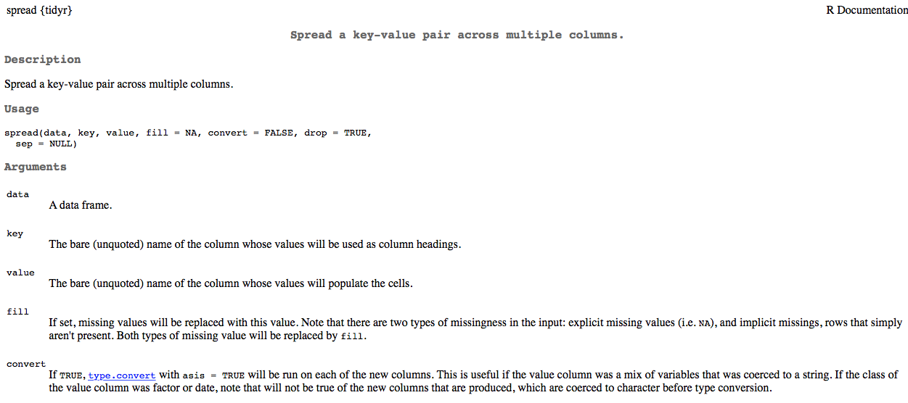

* The code on the previous slide basically puts our data in a tidy format. 

**BUT**

* We didn't store the result in an object (try printing `d` now)
* Need to store the tidy data in a new object (or reassign `d`)
* To "clean up" some, could transform the `item` variable to numeric

----
## Finish tidying the data

```{r full_tidy_exam1}
td <- d %>% 
  gather(item, score, -1:-2) %>% 
  mutate(item = parse_number(item))
```
* `parse_number()` comes from the *readr* package.
* To see the data you'll need to print `td` (or whatever you reassigned it as) to the console.

```{r print_tidy_data, echo = FALSE}
knitr::kable(head(td)) 
```

----
## An alternative
(please run this code, following the explanation)

```{r full_tidy_exam2}
td <- d %>% 
  gather(item, score, -1:-2) %>% 
  separate(item, c("discard", "item"), sep = "_") %>% 
  select(-discard)
```

----
## Why are tidy data useful?
* When used in conjunction with `dplyr`, tidy data can result in large gains in efficiency.

For example, suppose we want to calculate the proportion of students responding correctly to each item.

```{r prop_correct_echo1, eval = FALSE}
td %>% 
  group_by(item) %>% 
  summarize(prop = mean(score))
```

----
```{r prop_correct_eval, echo = FALSE}
td %>% 
  group_by(item) %>% 
  summarize(prop = mean(score))
```

----
What if we also wanted to know the standard deviation?

```{r prop_correct_sd}
td %>% 
  group_by(item) %>% 
  summarize(prop = mean(score),
            sd = sd(score))
```
----
What if we wanted to know the proportion correct for each item by gender?

```{r prop_correct_by_gender}
td %>% 
  group_by(item, gender) %>% 
  summarize(prop = mean(score))
```

----
## Verbs: *dplyr* 

* `group_by()`
* `filter()` and `slice()`
* `arrange()`
* `select()` and `rename()`
* `distinct()`
* `mutate()` and `transmutate()`
* `summarize()` (or `summarise()`)
* `sample_n()` and `sample_frac()`

What do you think each of the above do?

* Good overview of `dplyr` [here](https://cran.rstudio.com/web/packages/dplyr/vignettes/introduction.html).

----
We can take the previous example further, by piping the output into a plot

```{r prop_correct_by_gender_plot, fig.width = 13, fig.height = 5}  
td %>% 
  group_by(item, gender) %>% 
  summarize(prop = mean(score)) %>% 
  mutate(gender = as.factor(gender)) %>% 
  ggplot(aes(x = item, y = prop, color = gender)) +
  geom_point() +
  geom_line(aes(group = item))
```

----
But, probably better (clearer) to do it in two steps. 
<br>

First produce the data

```{r prop_correct_by_gender_plot_data}
pd <- td %>% 
  group_by(item, gender) %>% 
  summarize(prop = mean(score)) %>% 
  mutate(gender = as.factor(gender))
```
Then produce the plot

```{r prop_correct_by_gender_plot2, eval = FALSE}
ggplot(pd, aes(x = item, y = prop, color = gender)) +
  geom_point() +
  geom_line(aes(group = item))
```

----
## Note on plotting
The entire next lecture will be on plotting. We're discussing tidy data now because it's a great format for plotting with *ggplot2*. 

----
## Challenge (work by yourself or with a neighbor)
Remember, the following code calculates the mean score for each item. 

```{r prop_correct_echo2, eval = FALSE}
td %>% 
  group_by(item) %>% 
  summarize(prop = mean(score))
```

Try to modify the above code to produce raw scores for every student. If you're successful, try thinking about how you could calculate the average raw score by gender.

----
## Calculate Raw Scores
Modify the prior to:
* `group_by` student name
* `sum` score (rather than average it with `mean`)

```{r raw_scores}
td %>% 
  group_by(stu_name) %>% 
  summarize(raw_score = sum(score))
```

----
## Raw Scores by Gender
* `group_by` name and gender (so gender is in the summary)
* calculate raw scores
* redefine `group_by` to gender alone
* calculate mean

```{r raw_scores_by_gender}
td %>% 
  group_by(stu_name, gender) %>% 
  summarize(raw_score = sum(score)) %>% 
  group_by(gender) %>% 
  summarize(means = mean(raw_score))
```

----
## Point-biserial correlation
The point-biserial correlation represents the correlation between an item response (0/1) and the total score. It represents an index of item discrimination, because generally students' responding correctly should have higher raw scores than students responding incorrectly.

<br>
To calculate point biserial correlations, we need to 
* merge the raw scores into the raw data
* calculate the correlation between the item *score* and *raw_score* for each item

----
## Calculate raw scores and merge

Raw score calculation

```{r raw_calc}
raw <- td %>% 
  group_by(stu_name) %>% 
  summarize(raw_score = sum(score))
```

Merge with `td`

```{r merge}
td <- left_join(td, raw)
```

----
```{r filter_barbara}
filter(td, stu_name == "Barbara")

```


---
## Calculate Point-Biserials
(note, you get some warnings here about no variance)
```{r pt_biserials, warning = FALSE}
td %>% 
  group_by(item) %>% 
  summarize(pt_biserial = cor(score, raw_score))
```

---
## Spreading the data back out

Tidy data is great when conducting preliminary descriptives and for plotting the data. But if you're using other packages for analysis, it may need to be in a different format. 



----
## Spread *td*

```{r spread_td}
s_d <- td %>% 
  spread(item, score)
```
(print object to see data)

```{r print_spread_data, echo = FALSE}
knitr::kable(head(s_d))
```

----
## Fit model
We'll fit a 1PL IRT model.
* `ltm` package
* `rasch` function requires only item response data, with each column representing a unique item.

```{r model_data, message = FALSE, warning = FALSE}
md <- s_d %>% 
  select(-1:-3)

# install.packages("ltm")
library(ltm)
model <- rasch(md)
```

----
```{r mod_1_smry}
summary(model)
```

----
## One last note
For many models, you can get tidy output using the *broom* package (part of the *tidyverse*)

```{r lm_mod}
lmd <- td %>% 
  distinct(stu_name, .keep_all = TRUE) %>% 
  mutate(gender = as.factor(gender))

mod <- lm(raw_score ~ gender, data = lmd)
```

----
```{r broom_ex}
library(broom)
tidy(mod, conf.int = TRUE)
glance(mod)
```

----
Broom is particularly useful for things like plotting. The below code will work for any linear model (with any number of predictors)

```{r broom_plot, fig.width = 13, fig.height = 6}
tidy_mod <- tidy(mod, conf.int = TRUE)
ggplot(tidy_mod, aes(estimate, term, color = term)) +
  geom_errorbarh(aes(xmin = conf.low, xmax = conf.high)) +
    geom_vline(xintercept = 0)
```

---- .segue
# Lab

----
## *iris* data
Already available to you as soon as you launch R. 

```{r iris_data_echo, eval = FALSE}
data(iris)
head(iris)
str(iris)
summary(iris)
View(iris)
```

```{r iris_data, echo = FALSE}
knitr::kable(head(iris))
```

----
## Work with a neighbor to
* Identify the variables (not the column names, the variables)
* Sketch how these data would look  in a tidy form (at least mentally)
* What would be the first step in tidying these data? (use `View(iris)` to see the full dataset easier). 

Work with a partner to try to conduct the first step in tidying the data

----
## Step 1: Gather the sepal and petal columns

```{r iris_gather}
iris %>% 
  tbl_df() %>% 
  gather(flower_part, measurement, -Species)
```

----
## iris data
What needs to happen next? Are the data tidy?

>* Work with a partner to figure out the next step, and try to do it.
    + *Hint:* Use `"\\."` as your separator rather than just `"."`. I'll explain why momentarily.

----
## Step 2: Separate the flower_part column

```{r iris_separate}
iris %>% 
  tbl_df() %>% 
  gather(flower_part, measurement, -Species) %>% 
  separate(flower_part, c("flower_part", "measure_of"), sep = "\\.")
```

----
## iris data
What needs to happen next? Are the data tidy?

>* Nothing! They are tidy! Just need to store them in an object.
>* Now... Calculate the average Sepal Width by Species.
>* Explore the data in a few other ways of your choosing.

----
## Some descriptives
```{r iris_desc}
iris_tidy <- iris %>% 
  tbl_df() %>% 
  gather(flower_part, measurement, -Species) %>% 
  separate(flower_part, c("flower_part", "measure_of"), sep = "\\.")

iris_tidy %>% 
  group_by(Species, measure_of) %>% 
  summarize(mean = mean(measurement)) %>% 
  filter(measure_of == "Width")
```

----
## Some more descriptives

```{r iris_desc2}
iris_tidy %>% 
  group_by(Species, flower_part, measure_of) %>% 
  summarize(mean = mean(measurement), 
            standard_dev = sd(measurement),
            iqr = IQR(measurement))
```