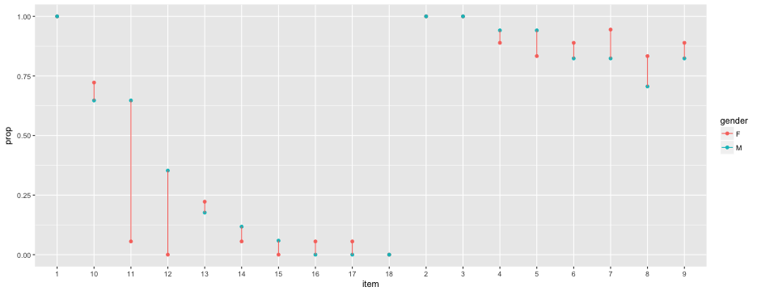
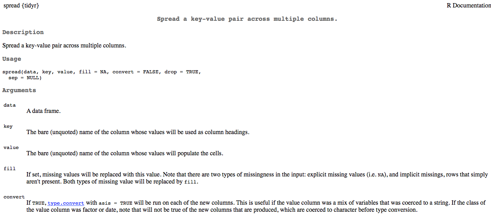
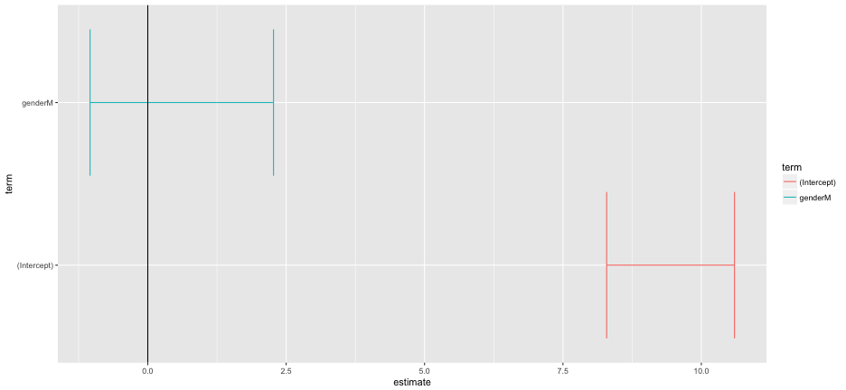

* The code on the previous slide basically puts our data in a tidy format. 

**BUT**

* We didn't store the result in an object (try printing `d` now)
* Need to store the tidy data in a new object (or reassign `d`)
* To "clean up" some, could transform the `item` variable to numeric

----
## Finish tidying the data


```r
td <- d %>% 
  gather(item, score, -1:-2) %>% 
  mutate(item = parse_number(item))
```
* `parse_number()` comes from the *readr* package.
* To see the data you'll need to print `td` (or whatever you reassigned it as) to the console.


|stu_name |gender | item| score|
|:--------|:------|----:|-----:|
|Adam     |M      |    1|     1|
|Anne     |F      |    1|     1|
|Audrey   |F      |    1|     1|
|Barbara  |F      |    1|     1|
|Bert     |M      |    1|     1|
|Betty    |F      |    1|     1|

----
## An alternative
(please run this code, following the explanation)


```r
td <- d %>% 
  gather(item, score, -1:-2) %>% 
  separate(item, c("discard", "item"), sep = "_") %>% 
  select(-discard)
```

----
## Why are tidy data useful?
* When used in conjunction with `dplyr`, tidy data can result in large gains in efficiency.

For example, suppose we want to calculate the proportion of students responding correctly to each item.


```r
td %>% 
  group_by(item) %>% 
  summarize(prop = mean(score))
```

----

```
## # A tibble: 18 × 2
##     item       prop
##    <chr>      <dbl>
## 1      1 1.00000000
## 2     10 0.68571429
## 3     11 0.34285714
## 4     12 0.17142857
## 5     13 0.20000000
## 6     14 0.08571429
## 7     15 0.02857143
## 8     16 0.02857143
## 9     17 0.02857143
## 10    18 0.00000000
## 11     2 1.00000000
## 12     3 1.00000000
## 13     4 0.91428571
## 14     5 0.88571429
## 15     6 0.85714286
## 16     7 0.88571429
## 17     8 0.77142857
## 18     9 0.85714286
```

----
What if we also wanted to know the standard deviation?


```r
td %>% 
  group_by(item) %>% 
  summarize(prop = mean(score),
            sd = sd(score))
```

```
## # A tibble: 18 × 3
##     item       prop        sd
##    <chr>      <dbl>     <dbl>
## 1      1 1.00000000 0.0000000
## 2     10 0.68571429 0.4710082
## 3     11 0.34285714 0.4815940
## 4     12 0.17142857 0.3823853
## 5     13 0.20000000 0.4058397
## 6     14 0.08571429 0.2840286
## 7     15 0.02857143 0.1690309
## 8     16 0.02857143 0.1690309
## 9     17 0.02857143 0.1690309
## 10    18 0.00000000 0.0000000
## 11     2 1.00000000 0.0000000
## 12     3 1.00000000 0.0000000
## 13     4 0.91428571 0.2840286
## 14     5 0.88571429 0.3228029
## 15     6 0.85714286 0.3550358
## 16     7 0.88571429 0.3228029
## 17     8 0.77142857 0.4260430
## 18     9 0.85714286 0.3550358
```
----
What if we wanted to know the proportion correct for each item by gender?


```r
td %>% 
  group_by(item, gender) %>% 
  summarize(prop = mean(score))
```

```
## Source: local data frame [36 x 3]
## Groups: item [?]
## 
##     item gender       prop
##    <chr>  <chr>      <dbl>
## 1      1      F 1.00000000
## 2      1      M 1.00000000
## 3     10      F 0.72222222
## 4     10      M 0.64705882
## 5     11      F 0.05555556
## 6     11      M 0.64705882
## 7     12      F 0.00000000
## 8     12      M 0.35294118
## 9     13      F 0.22222222
## 10    13      M 0.17647059
## # ... with 26 more rows
```

----
## Verbs: *dplyr* 

* `group_by()`
* `filter()` and `slice()`
* `arrange()`
* `select()` and `rename()`
* `distinct()`
* `mutate()` and `transmutate()`
* `summarize()` (or `summarise()`)
* `sample_n()` and `sample_frac()`

What do you think each of the above do?

* Good overview of `dplyr` [here](https://cran.rstudio.com/web/packages/dplyr/vignettes/introduction.html).

----
We can take the previous example further, by piping the output into a plot


```r
td %>% 
  group_by(item, gender) %>% 
  summarize(prop = mean(score)) %>% 
  mutate(gender = as.factor(gender)) %>% 
  ggplot(aes(x = item, y = prop, color = gender)) +
  geom_point() +
  geom_line(aes(group = item))
```



----
But, probably better (clearer) to do it in two steps. 
<br>

First produce the data


```r
pd <- td %>% 
  group_by(item, gender) %>% 
  summarize(prop = mean(score)) %>% 
  mutate(gender = as.factor(gender))
```
Then produce the plot


```r
ggplot(pd, aes(x = item, y = prop, color = gender)) +
  geom_point() +
  geom_line(aes(group = item))
```

----
## Note on plotting
The entire next lecture will be on plotting. We're discussing tidy data now because it's a great format for plotting with *ggplot2*. 

----
## Challenge (work by yourself or with a neighbor)
Remember, the following code calculates the mean score for each item. 


```r
td %>% 
  group_by(item) %>% 
  summarize(prop = mean(score))
```

Try to modify the above code to produce raw scores for every student. If you're successful, try thinking about how you could calculate the average raw score by gender.

----
## Calculate Raw Scores
Modify the prior to:
* `group_by` student name
* `sum` score (rather than average it with `mean`)


```r
td %>% 
  group_by(stu_name) %>% 
  summarize(raw_score = sum(score))
```

```
## # A tibble: 35 × 2
##    stu_name raw_score
##       <chr>     <int>
## 1      Adam         7
## 2      Anne        10
## 3    Audrey        11
## 4   Barbara         6
## 5      Bert         8
## 6     Betty         9
## 7    Blaise        13
## 8    Brenda        10
## 9   Britton         8
## 10    Carol         6
## # ... with 25 more rows
```

----
## Raw Scores by Gender
* `group_by` name and gender (so gender is in the summary)
* calculate raw scores
* redefine `group_by` to gender alone
* calculate mean


```r
td %>% 
  group_by(stu_name, gender) %>% 
  summarize(raw_score = sum(score)) %>% 
  group_by(gender) %>% 
  summarize(means = mean(raw_score))
```

```
## # A tibble: 2 × 2
##   gender     means
##    <chr>     <dbl>
## 1      F  9.444444
## 2      M 10.058824
```

----
## Point-biserial correlation
The point-biserial correlation represents the correlation between an item response (0/1) and the total score. It represents an index of item discrimination, because generally students' responding correctly should have higher raw scores than students responding incorrectly.

<br>
To calculate point biserial correlations, we need to 
* merge the raw scores into the raw data
* calculate the correlation between the item *score* and *raw_score* for each item

----
## Calculate raw scores and merge

Raw score calculation


```r
raw <- td %>% 
  group_by(stu_name) %>% 
  summarize(raw_score = sum(score))
```

Merge with `td`


```r
td <- left_join(td, raw)
```

```
## Joining, by = "stu_name"
```

----

```r
filter(td, stu_name == "Barbara")
```

```
## # A tibble: 18 × 5
##    stu_name gender  item score raw_score
##       <chr>  <chr> <chr> <int>     <int>
## 1   Barbara      F     1     1         6
## 2   Barbara      F     2     1         6
## 3   Barbara      F     3     1         6
## 4   Barbara      F     4     1         6
## 5   Barbara      F     5     0         6
## 6   Barbara      F     6     0         6
## 7   Barbara      F     7     1         6
## 8   Barbara      F     8     0         6
## 9   Barbara      F     9     0         6
## 10  Barbara      F    10     1         6
## 11  Barbara      F    11     0         6
## 12  Barbara      F    12     0         6
## 13  Barbara      F    13     0         6
## 14  Barbara      F    14     0         6
## 15  Barbara      F    15     0         6
## 16  Barbara      F    16     0         6
## 17  Barbara      F    17     0         6
## 18  Barbara      F    18     0         6
```


---
## Calculate Point-Biserials
(note, you get some warnings here about no variance)

```r
td %>% 
  group_by(item) %>% 
  summarize(pt_biserial = cor(score, raw_score))
```

```
## # A tibble: 18 × 2
##     item pt_biserial
##    <chr>       <dbl>
## 1      1          NA
## 2     10   0.6046692
## 3     11   0.5381468
## 4     12   0.4031706
## 5     13   0.5693729
## 6     14   0.2064809
## 7     15   0.3095606
## 8     16   0.3095606
## 9     17   0.3095606
## 10    18          NA
## 11     2          NA
## 12     3          NA
## 13     4   0.5724589
## 14     5   0.5700584
## 15     6   0.5440214
## 16     7   0.4177527
## 17     8   0.7484416
## 18     9   0.7171191
```

---
## Spreading the data back out

Tidy data is great when conducting preliminary descriptives and for plotting the data. But if you're using other packages for analysis, it may need to be in a different format. 



----
## Spread *td*


```r
s_d <- td %>% 
  spread(item, score)
```
(print object to see data)


|stu_name |gender | raw_score|  1| 10| 11| 12| 13| 14| 15| 16| 17| 18|  2|  3|  4|  5|  6|  7|  8|  9|
|:--------|:------|---------:|--:|--:|--:|--:|--:|--:|--:|--:|--:|--:|--:|--:|--:|--:|--:|--:|--:|--:|
|Adam     |M      |         7|  1|  0|  0|  0|  0|  0|  0|  0|  0|  0|  1|  1|  1|  1|  1|  1|  0|  0|
|Anne     |F      |        10|  1|  1|  0|  0|  0|  0|  0|  0|  0|  0|  1|  1|  1|  1|  1|  1|  1|  1|
|Audrey   |F      |        11|  1|  1|  0|  0|  1|  0|  0|  0|  0|  0|  1|  1|  1|  1|  1|  1|  1|  1|
|Barbara  |F      |         6|  1|  1|  0|  0|  0|  0|  0|  0|  0|  0|  1|  1|  1|  0|  0|  1|  0|  0|
|Bert     |M      |         8|  1|  1|  0|  0|  0|  0|  0|  0|  0|  0|  1|  1|  1|  1|  0|  1|  0|  1|
|Betty    |F      |         9|  1|  0|  0|  0|  0|  0|  0|  0|  0|  0|  1|  1|  1|  1|  1|  1|  1|  1|

----
## Fit model
We'll fit a 1PL IRT model.
* `ltm` package
* `rasch` function requires only item response data, with each column representing a unique item.


```r
md <- s_d %>% 
  select(-1:-3)

# install.packages("ltm")
library(ltm)
model <- rasch(md)
```

----

```r
summary(model)
```

```
## 
## Call:
## rasch(data = md)
## 
## Model Summary:
##    log.Lik      AIC      BIC
##  -156.3639 350.7277 380.2793
## 
## Coefficients:
##              value    std.err  z.vals
## Dffclt.1  -14.0580 12394.5102 -0.0011
## Dffclt.10  -0.6312     0.3161 -1.9971
## Dffclt.11   0.5733     0.3035  1.8886
## Dffclt.12   1.3009     0.3802  3.4217
## Dffclt.13   1.1568     0.3601  3.2128
## Dffclt.14   1.8738     0.4872  3.8457
## Dffclt.15   2.6305     0.7249  3.6288
## Dffclt.16   2.6305     0.7249  3.6288
## Dffclt.17   2.6305     0.7249  3.6288
## Dffclt.18  14.0580 16371.2499  0.0009
## Dffclt.2  -14.0580 12394.5102 -0.0011
## Dffclt.3  -14.0580 12394.5102 -0.0011
## Dffclt.4   -1.9363     0.5052 -3.8327
## Dffclt.5   -1.6854     0.4542 -3.7108
## Dffclt.6   -1.4794     0.4181 -3.5383
## Dffclt.7   -1.6854     0.4542 -3.7108
## Dffclt.8   -1.0019     0.3521 -2.8458
## Dffclt.9   -1.4798     0.4182 -3.5387
## Dscrmn      1.8186     0.3370  5.3960
## 
## Integration:
## method: Gauss-Hermite
## quadrature points: 21 
## 
## Optimization:
## Convergence: 0 
## max(|grad|): 0.002 
## quasi-Newton: BFGS
```

----
## One last note
For many models, you can get tidy output using the *broom* package (part of the *tidyverse*)


```r
lmd <- td %>% 
  distinct(stu_name, .keep_all = TRUE) %>% 
  mutate(gender = as.factor(gender))

mod <- lm(raw_score ~ gender, data = lmd)
```

----

```r
library(broom)
tidy(mod, conf.int = TRUE)
```

```
##          term  estimate std.error statistic      p.value  conf.low
## 1 (Intercept) 9.4444444 0.5676249 16.638531 1.300394e-17  8.289603
## 2     genderM 0.6143791 0.8144623  0.754337 4.559964e-01 -1.042657
##   conf.high
## 1 10.599286
## 2  2.271415
```

```r
glance(mod)
```

```
##    r.squared adj.r.squared    sigma statistic   p.value df    logLik
## 1 0.01695088   -0.01283849 2.408228 0.5690244 0.4559964  2 -79.39434
##        AIC      BIC deviance df.residual
## 1 164.7887 169.4547 191.3856          33
```

----
Broom is particularly useful for things like plotting. The below code will work for any linear model (with any number of predictors)


```r
tidy_mod <- tidy(mod, conf.int = TRUE)
ggplot(tidy_mod, aes(estimate, term, color = term)) +
  geom_errorbarh(aes(xmin = conf.low, xmax = conf.high)) +
    geom_vline(xintercept = 0)
```



---- .segue
# Lab

----
## *iris* data
Already available to you as soon as you launch R. 


```r
data(iris)
head(iris)
str(iris)
summary(iris)
View(iris)
```


| Sepal.Length| Sepal.Width| Petal.Length| Petal.Width|Species |
|------------:|-----------:|------------:|-----------:|:-------|
|          5.1|         3.5|          1.4|         0.2|setosa  |
|          4.9|         3.0|          1.4|         0.2|setosa  |
|          4.7|         3.2|          1.3|         0.2|setosa  |
|          4.6|         3.1|          1.5|         0.2|setosa  |
|          5.0|         3.6|          1.4|         0.2|setosa  |
|          5.4|         3.9|          1.7|         0.4|setosa  |

----
## Work with a neighbor to
* Identify the variables (not the column names, the variables)
* Sketch how these data would look  in a tidy form (at least mentally)
* What would be the first step in tidying these data? (use `View(iris)` to see the full dataset easier). 

Work with a partner to try to conduct the first step in tidying the data

----
## Step 1: Gather the sepal and petal columns


```r
iris %>% 
  tbl_df() %>% 
  gather(flower_part, measurement, -Species)
```

```
## # A tibble: 600 × 3
##    Species  flower_part measurement
##     <fctr>        <chr>       <dbl>
## 1   setosa Sepal.Length         5.1
## 2   setosa Sepal.Length         4.9
## 3   setosa Sepal.Length         4.7
## 4   setosa Sepal.Length         4.6
## 5   setosa Sepal.Length         5.0
## 6   setosa Sepal.Length         5.4
## 7   setosa Sepal.Length         4.6
## 8   setosa Sepal.Length         5.0
## 9   setosa Sepal.Length         4.4
## 10  setosa Sepal.Length         4.9
## # ... with 590 more rows
```

----
## iris data
What needs to happen next? Are the data tidy?

>* Work with a partner to figure out the next step, and try to do it.
    + *Hint:* Use `"\\."` as your separator rather than just `"."`. I'll explain why momentarily.

----
## Step 2: Separate the flower_part column


```r
iris %>% 
  tbl_df() %>% 
  gather(flower_part, measurement, -Species) %>% 
  separate(flower_part, c("flower_part", "measure_of"), sep = "\\.")
```

```
## # A tibble: 600 × 4
##    Species flower_part measure_of measurement
## *   <fctr>       <chr>      <chr>       <dbl>
## 1   setosa       Sepal     Length         5.1
## 2   setosa       Sepal     Length         4.9
## 3   setosa       Sepal     Length         4.7
## 4   setosa       Sepal     Length         4.6
## 5   setosa       Sepal     Length         5.0
## 6   setosa       Sepal     Length         5.4
## 7   setosa       Sepal     Length         4.6
## 8   setosa       Sepal     Length         5.0
## 9   setosa       Sepal     Length         4.4
## 10  setosa       Sepal     Length         4.9
## # ... with 590 more rows
```

----
## iris data
What needs to happen next? Are the data tidy?

>* Nothing! They are tidy! Just need to store them in an object.
>* Now... Calculate the average Sepal Width by Species.
>* Explore the data in a few other ways of your choosing.

----
## Some descriptives

```r
iris_tidy <- iris %>% 
  tbl_df() %>% 
  gather(flower_part, measurement, -Species) %>% 
  separate(flower_part, c("flower_part", "measure_of"), sep = "\\.")

iris_tidy %>% 
  group_by(Species, measure_of) %>% 
  summarize(mean = mean(measurement)) %>% 
  filter(measure_of == "Width")
```

```
## Source: local data frame [3 x 3]
## Groups: Species [3]
## 
##      Species measure_of  mean
##       <fctr>      <chr> <dbl>
## 1     setosa      Width 1.837
## 2 versicolor      Width 2.048
## 3  virginica      Width 2.500
```

----
## Some more descriptives


```r
iris_tidy %>% 
  group_by(Species, flower_part, measure_of) %>% 
  summarize(mean = mean(measurement), 
            standard_dev = sd(measurement),
            iqr = IQR(measurement))
```

```
## Source: local data frame [12 x 6]
## Groups: Species, flower_part [?]
## 
##       Species flower_part measure_of  mean standard_dev   iqr
##        <fctr>       <chr>      <chr> <dbl>        <dbl> <dbl>
## 1      setosa       Petal     Length 1.462    0.1736640 0.175
## 2      setosa       Petal      Width 0.246    0.1053856 0.100
## 3      setosa       Sepal     Length 5.006    0.3524897 0.400
## 4      setosa       Sepal      Width 3.428    0.3790644 0.475
## 5  versicolor       Petal     Length 4.260    0.4699110 0.600
## 6  versicolor       Petal      Width 1.326    0.1977527 0.300
## 7  versicolor       Sepal     Length 5.936    0.5161711 0.700
## 8  versicolor       Sepal      Width 2.770    0.3137983 0.475
## 9   virginica       Petal     Length 5.552    0.5518947 0.775
## 10  virginica       Petal      Width 2.026    0.2746501 0.500
## 11  virginica       Sepal     Length 6.588    0.6358796 0.675
## 12  virginica       Sepal      Width 2.974    0.3224966 0.375
```
